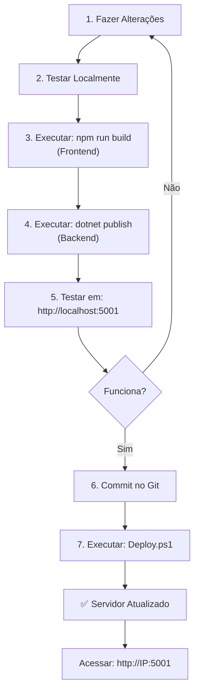

# 📚 Documentação - Sistema de Empresas

## 1. Estrutura do Projeto

```
SistemaEmpresas/
├── frontend/                 # Aplicação React + TypeScript + Vite
│   ├── src/
│   ├── dist/                # Build compilado (gerado)
│   ├── package.json
│   └── vite.config.ts
│
├── SistemaEmpresas/         # Backend .NET 8
│   ├── Program.cs
│   ├── appsettings.json
│   ├── Controllers/
│   ├── Models/
│   ├── Services/
│   ├── Data/
│   ├── certificado/         # Certificados digitais
│   │   ├── Irrigacao.pfx    (senha: irrig02781)
│   │   └── CHINELLATO.pfx   (senha: ct220615)
│   └── SistemaEmpresas.csproj
│
└── publish/                 # Versão compilada para produção
    ├── SistemaEmpresas.exe
    ├── appsettings.json
    ├── certificado/
    └── wwwroot/             # Frontend compilado

```

## 2. Tecnologias

| Componente | Tecnologia | Versão |
|-----------|-----------|---------|
| Backend | .NET | 8.0 |
| Linguagem Backend | C# | - |
| Frontend | React | 18 |
| Build Frontend | Vite | 7.1.12 |
| Linguagem Frontend | TypeScript | Latest |
| Banco Dados | SQL Server | 2014 |
| ORM | Entity Framework Core | - |
| Autenticação | JWT | - |
| Certificado | X509Certificate2 | - |

## 3. 🔧 Como Gerar Nova Versão (Desenvolvimento)

### 3.1 Prerequisites
- Node.js 18+ instalado
- .NET 8 SDK instalado
- Git instalado

### 3.2 Passos para Gerar Build

#### Passo 1: Fazer as alterações no código
```powershell
# No VS Code/Visual Studio, edite os arquivos necessários
# Exemplos:
# - Adicione novo controller
# - Modifique componente React
# - Atualize serviços
```

#### Passo 2: Build do Frontend
```powershell
cd C:\Projetos\SistemaEmpresas\frontend

# Instalar dependências (se necessário)
npm install

# Compilar para produção
npm run build

# Output: dist/ folder (contém index.html + JS/CSS otimizados)
```

#### Passo 3: Build do Backend
```powershell
cd C:\Projetos\SistemaEmpresas\SistemaEmpresas

# Limpar builds anteriores
dotnet clean

# Restaurar dependências
dotnet restore

# Compilar para Release (produção)
dotnet publish -c Release -o ..\publish --force

# Output: ..\publish\ folder (contém executáveis e DLLs)
```

#### Passo 4: Copiar Frontend compilado
```powershell
# O wwwroot já é criado automaticamente, mas atualize manualmente se necessário
Copy-Item -Path "C:\Projetos\SistemaEmpresas\frontend\dist\*" `
          -Destination "C:\Projetos\SistemaEmpresas\publish\wwwroot\" `
          -Recurse -Force
```

#### Passo 5: Copiar Certificados (se não existirem)
```powershell
Copy-Item -Path "C:\Projetos\SistemaEmpresas\SistemaEmpresas\certificado\*" `
          -Destination "C:\Projetos\SistemaEmpresas\publish\certificado\" `
          -Force
```

### 3.3 Script Automatizado (Recomendado)

Crie um arquivo `build.ps1`:

```powershell
# build.ps1
param(
    [switch]$Server = $false
)

$projectRoot = "C:\Projetos\SistemaEmpresas"

Write-Host "🔨 Iniciando build completo..." -ForegroundColor Cyan

# 1. Frontend
Write-Host "`n📦 Compilando Frontend..." -ForegroundColor Yellow
cd "$projectRoot\frontend"
npm run build
if ($LASTEXITCODE -ne 0) { Write-Host "❌ Erro no build do frontend"; exit 1 }

# 2. Backend
Write-Host "`n📦 Compilando Backend..." -ForegroundColor Yellow
cd "$projectRoot\SistemaEmpresas"
dotnet publish -c Release -o ..\publish --force
if ($LASTEXITCODE -ne 0) { Write-Host "❌ Erro no build do backend"; exit 1 }

# 3. Copiar Frontend
Write-Host "`n📦 Copiando Frontend compilado..." -ForegroundColor Yellow
Copy-Item -Path "$projectRoot\frontend\dist\*" `
          -Destination "$projectRoot\publish\wwwroot\" `
          -Recurse -Force

Write-Host "`n✅ Build concluído com sucesso!" -ForegroundColor Green
Write-Host "📁 Versão pronta em: $projectRoot\publish\" -ForegroundColor Green

# Se flag -Server, copiar para o servidor
if ($Server) {
    Write-Host "`n📤 Copiando para servidor..." -ForegroundColor Cyan
    Stop-Service -Name "SistemaEmpresas" -ErrorAction SilentlyContinue
    Start-Sleep -Seconds 2
    Copy-Item -Path "$projectRoot\publish\*" `
              -Destination "C:\SistemaEmpresas\publish\" `
              -Recurse -Force
    Start-Service -Name "SistemaEmpresas"
    Write-Host "✅ Servidor atualizado e reiniciado!" -ForegroundColor Green
}
```

**Uso:**
```powershell
# Apenas gerar versão local
.\build.ps1

# Gerar e copiar para servidor
.\build.ps1 -Server
```

## 4. 📤 Como Atualizar o Servidor

### 4.1 Atualização Manual (Recomendado)

```powershell
# 1. Gerar nova versão localmente
cd C:\Projetos\SistemaEmpresas\SistemaEmpresas
dotnet publish -c Release -o ..\publish --force

# 2. Copiar frontend atualizado
Copy-Item -Path "C:\Projetos\SistemaEmpresas\frontend\dist\*" `
          -Destination "C:\Projetos\SistemaEmpresas\publish\wwwroot\" `
          -Recurse -Force

# 3. Parar o serviço no servidor
Stop-Service -Name "SistemaEmpresas" -Force

# 4. Aguardar liberação da porta
Start-Sleep -Seconds 2

# 5. Copiar versão para servidor
Remove-Item -Path "C:\SistemaEmpresas\publish\*" -Recurse -Force -ErrorAction SilentlyContinue
Copy-Item -Path "C:\Projetos\SistemaEmpresas\publish\*" `
          -Destination "C:\SistemaEmpresas\publish\" `
          -Recurse -Force

# 6. Iniciar serviço
Start-Service -Name "SistemaEmpresas"

Write-Host "✅ Servidor atualizado!" -ForegroundColor Green
```

### 4.2 Com Script (Mais Fácil)

```powershell
# Deploy.ps1
param(
    [string]$Version = "1.0.0"
)

$sourceDir = "C:\Projetos\SistemaEmpresas\publish"
$destDir = "C:\SistemaEmpresas\publish"

Write-Host "📤 Iniciando deploy v$Version..." -ForegroundColor Cyan

# Parar serviço
Write-Host "⏹️  Parando serviço..." -ForegroundColor Yellow
Stop-Service -Name "SistemaEmpresas" -Force -ErrorAction SilentlyContinue
Start-Sleep -Seconds 3

# Copiar arquivos
Write-Host "📁 Copiando arquivos..." -ForegroundColor Yellow
Remove-Item -Path "$destDir\*" -Recurse -Force -ErrorAction SilentlyContinue
Copy-Item -Path "$sourceDir\*" -Destination "$destDir\" -Recurse -Force

# Iniciar serviço
Write-Host "▶️  Iniciando serviço..." -ForegroundColor Yellow
Start-Service -Name "SistemaEmpresas"
Start-Sleep -Seconds 2

# Verificar status
$service = Get-Service -Name "SistemaEmpresas"
if ($service.Status -eq "Running") {
    Write-Host "✅ Deploy concluído com sucesso! v$Version" -ForegroundColor Green
    Write-Host "🌐 Acesse: http://localhost:5001" -ForegroundColor Green
} else {
    Write-Host "❌ Erro ao iniciar serviço" -ForegroundColor Red
}
```

## 5. 🔄 Fluxo Completo de Desenvolvimento



## 6. 🐛 Troubleshooting

### Erro: Porta 5001 já em uso
```powershell
# Encontrar processo usando porta
netstat -ano | findstr :5001

# Matar processo (PID = número da coluna)
taskkill /PID <PID> /F
```

### Erro: Certificado não encontrado
```powershell
# Verificar se certificados existem
Get-ChildItem -Path "C:\SistemaEmpresas\publish\certificado\"

# Copiar manualmente se necessário
Copy-Item -Path "C:\Projetos\SistemaEmpresas\SistemaEmpresas\certificado\*" `
          -Destination "C:\SistemaEmpresas\publish\certificado\" -Force
```

### Erro: SQL Connection
```powershell
# Verificar connection string em appsettings.json
cat "C:\SistemaEmpresas\publish\appsettings.json" | findstr "ConexaoPadrao"

# Testar conexão
sqlcmd -S SRVSQL\SQLEXPRESS -U admin -P "conectairrig@" -d IRRIGACAO -Q "SELECT 1"
```

### Serviço não inicia
```powershell
# Ver logs de erro
Get-EventLog -LogName Application -Source "SistemaEmpresas" -Newest 10

# Ou verificar arquivo de log se existir
Get-ChildItem -Path "C:\SistemaEmpresas\publish\logs\" -Recurse
```

## 7. 📊 Checklist de Deploy

- [ ] Todas as alterações fizeram commit no Git
- [ ] Frontend compilou sem erros (`npm run build`)
- [ ] Backend compilou sem erros (`dotnet publish`)
- [ ] Testou localmente em http://localhost:5001
- [ ] Verificou appsettings.json (conexão, certificados)
- [ ] Parou o serviço Windows do servidor
- [ ] Copiou arquivos para C:\SistemaEmpresas\publish
- [ ] Iniciou o serviço Windows
- [ ] Verificou se serviço está "Running"
- [ ] Acessou http://IP:5001 com sucesso
- [ ] Testou funcionalidades principais

## 8. 📝 Configurações Importantes

### appsettings.json (Produção)
```json
{
    "Urls": "http://0.0.0.0:5001",
    "ConnectionStrings": {
        "ConexaoPadrao": "Server=SRVSQL\\SQLEXPRESS;Database=IRRIGACAO;User Id=admin;Password=conectairrig@;TrustServerCertificate=True;"
    },
    "CertificadosDigitais": {
        "Irrigacao": {
            "CaminhoArquivo": "certificado\\Irrigacao.pfx",
            "Senha": "irrig02781"
        },
        "Chinellato": {
            "CaminhoArquivo": "certificado\\CHINELLATO.pfx",
            "Senha": "ct220615"
        }
    }
}
```

### Credenciais SQL
```
Servidor: SRVSQL\SQLEXPRESS
Usuário: admin
Senha: conectairrig@
Banco Padrão: IRRIGACAO
```

### Certificados Digitais
```
Irrigação: certificado\Irrigacao.pfx (irrig02781)
Chinellato: certificado\CHINELLATO.pfx (ct220615)
Válido até: 19/12/2025
```

## 9. 📞 Contato & Suporte

- **GitHub**: Nicolasirrigpenapolis/SistemaIrrigacao
- **Branch**: main
- **Desenvolvedor**: [Seu Nome]
- **Última atualização**: 27/11/2025
